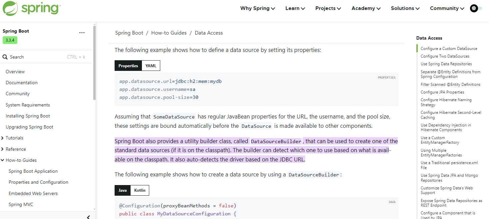

# Learning DataSource and Spring Data JPA project

In this project, we are going to learn about javax.sql.DataSource and its related stuff.

- `Spring Version: 6.1.13`
- `Spring Boot Version: 3.3.4`
- `Hibernate ORM version: 6.5.3.Final`

During debugging, you will see following crucial properties related to `dataSource` object:

- `connectionTimeout`
- `driverClassName`
- `jdbcUrl`
- `password`
- `poolName`
- `username`
- `validationTimeout`

There are also some other properties but for now, we will focus on above properties. These properties are coming from `com.zaxxer.hikari.HikariConfig`.

1. `connectionTimeout`: Defines the maximum time application is willing to wait for a connection from the pool.

2. `driverClassName`: 


## What is the default DataSource implementation in auto-detect in spring boot ? 

- `https://stackoverflow.com/questions/36424666/what-is-the-default-datasource-implementation-in-auto-detect`


`org.springframework.boot.autoconfigure.jdbc.DataSourceBuilder` is responsible for autodetecting DataSource implementation. Its javadoc states:

`Convenience class for building a DataSource with common implementations and properties. If Tomcat, HikariCP or Commons DBCP are on the classpath one of them will be selected (in that order with Tomcat first)`

And the list of autodetected implementations

```java
private static final String[] DATA_SOURCE_TYPE_NAMES = new String[] {
    "org.apache.tomcat.jdbc.pool.DataSource",
    "com.zaxxer.hikari.HikariDataSource",
    "org.apache.commons.dbcp.BasicDataSource",
    "org.apache.commons.dbcp2.BasicDataSource" };
```

So if your project has Commons DBCP in classpath and it doesn't contain Tomcat and HikariCP implemenations then BasicDataSource will be used.

In our project, we are using `HikariDataSource` as shown in the following image that I had taken during debugging process in vs code.


`com.zaxxer.hikari.HikariDataSource` is the default implementation in spring boot of `javax.sql.DataSource`.


As you see in above image, `HikariDataSource` implements the `javax.sql.DataSource` interface and also `java.io.Closeable` interface.


### Running the project:

- `mvnw spring-boot:run`

- [Spring Boot maven plugin official docs](https://docs.spring.io/spring-boot/maven-plugin/using.html#using)

`spring-boot` is a maven plugin while `run` is one of its goals.



- https://docs.spring.io/spring-boot/how-to/data-access.html#:~:text=Spring%20Boot%20also%20provides%20a,based%20on%20the%20JDBC%20URL.


### Overriding application.properties configuration file.

- `mvnw spring-boot:run -Dspring-boot.run.jvmArguments="-Dspring.datasource.url=jdbc:mysql://localhost:3306/testdb -Dspring.datasource.username=root -Dspring.datasource.password=abcabc<<<123 -Dspring.main.banner-mode=off"`